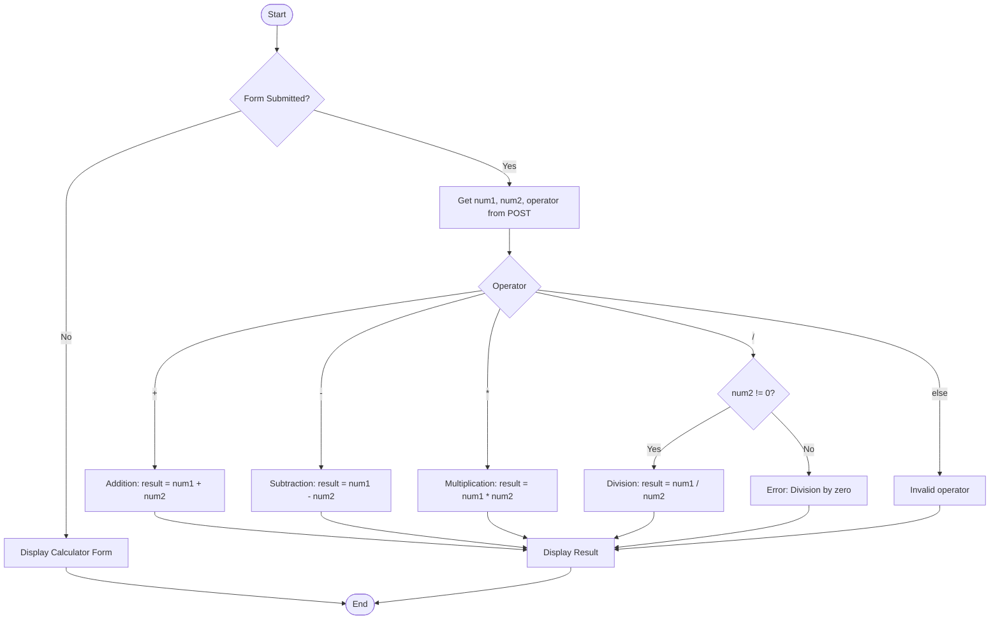

# Calculator App Flowchart

Below is a flowchart describing the logic of the PHP calculator app:

- The flowchart uses Mermaid syntax, which can be rendered in many Markdown viewers and tools.
- It covers the main logic: form submission, input retrieval, operator selection, calculation, error handling, and result display.
